# awswiz

> Friendly AWS credentials CLI — interactive wizards for profiles, MFA, assume-role, SSO and more.

**awswiz** takes the friction out of managing AWS credentials from the terminal. Instead of memorizing `aws sts` incantations or hand-editing `~/.aws`, you answer simple questions. It talks to AWS directly through the SDK and edits your `~/.aws` files for you — so it works **without the `aws` CLI installed**. The UI speaks **English and Spanish** (auto-detected).

<p align="center">
  
</p>

## Install

```bash
npm install -g @fsichi/awswiz
# or run it without installing:
npx @fsichi/awswiz whoami
```

After installing, the command is just `awswiz` (e.g. `awswiz whoami`).

Requires Node.js >= 20. That's it — no `aws` CLI, no Python, no setup.

## Commands

Run `awswiz` on its own (in a terminal) to open an interactive menu. Or call any command directly:

| Command | What it does |
|---|---|
| `awswiz status` | Which sessions are alive and when do they expire? Your daily "am I still logged in?". |
| `awswiz whoami` | Which account, role and profile am I using right now? |
| `awswiz mfa` | Start an MFA session — auto-discovers your device, creates a temporary `<profile>-mfa` profile. |
| `awswiz assume` | Assume an IAM role (cross-account), with MFA, and save the temporary credentials. |
| `awswiz login` | Sign in to IAM Identity Center (SSO) via the browser device flow — then verifies it really worked. |
| `awswiz console` | Open the AWS **web console** in your browser, already signed in with a profile. |
| `awswiz exec` | Run any command with a profile's credentials: `awswiz exec -p prod -- terraform plan`. |
| `awswiz use` | Switch the active profile (prints the right export line, or writes `[default]`). |
| `awswiz region` | Set the default region for a profile. |
| `awswiz profile` | Manage profiles: `list`, `add` (masked secret input), `edit`, `remove`. |
| `awswiz doctor` | Check your setup: `~/.aws` files, profiles, and clock skew (the silent MFA killer). |
| `awswiz update` | Update awswiz to the latest version. |

### `awswiz status`

The command you run every morning. Shows each temporary session (MFA / assumed roles) with its remaining lifetime, each SSO session's token state, and the active profile — with the exact renewal command next to anything expired:

```
Temporary sessions:
  horsego-mfa   ✔ expires in 11h 40m
  codetria-mfa  ✖ expired   → awswiz mfa -p codetria

SSO sessions:
  boostivity    ✔ signed in — 6h 12m left

Active profile: default (AWS_PROFILE not set)
```

Sessions created by awswiz record their expiration (`aws_session_expiration`) so status can tell you *before* AWS fails with a cryptic `ExpiredToken`.

### `awswiz exec`

Run one command with a profile's credentials — no shell exports, no `[default]` rewriting: `awswiz exec -p horsego-mfa -- aws s3 ls`. Everything after `--` is passed through untouched. Warns upfront if the session is already expired.

### `awswiz console`

`awswiz console -p prod` opens the AWS web console in your browser, already signed in with that profile (via the AWS sign-in federation endpoint). Works with long-lived keys (federation token), SSO and role profiles. `--print-url` prints the link instead of opening the browser — note the URL itself is a short-lived credential.

### `awswiz mfa`

The one you'll run every morning. Pick the profile with your long-lived keys; awswiz **auto-discovers your MFA device** (via `iam:ListMFADevices`), asks for the 6-digit code, and stores a temporary session as `<profile>-mfa` — the long-standing convention. It shows when the session expires.

```bash
awswiz mfa                              # interactive
awswiz mfa -p myprofile -c 123456       # non-interactive (scripts/CI)
```

### `awswiz assume`

Assume a role in another account using a source profile's credentials. Prompts for MFA when the source needs it, then writes the temporary credentials to a profile you name.

### `awswiz login` (SSO)

Runs the IAM Identity Center device-authorization flow: opens your browser, you approve a code, and awswiz caches the token where the SDK/CLI expect it.

### `awswiz use`

A tool can't change your parent shell's environment, so `use` prints the exact line for your shell (`export AWS_PROFILE=…`, PowerShell `$env:…`, fish `set -x …`). Prefer no env var? `awswiz use <profile> --default` copies the profile into `[default]` so plain `aws`/SDK calls use it everywhere.

### `awswiz doctor`

Verifies your `~/.aws` files exist, counts your profiles, and — crucially — checks your clock against AWS. MFA codes are time-based, so a skewed clock produces baffling "invalid token" errors; doctor catches it.

## How it works

| Concern | Approach |
|---|---|
| **Profiles** | awswiz reads/writes `~/.aws/config` and `~/.aws/credentials` directly, with a comment-preserving INI editor — your formatting and comments survive. |
| **MFA / assume-role** | `@aws-sdk/client-sts` (`GetSessionToken`, `AssumeRole`). |
| **MFA device discovery** | `@aws-sdk/client-iam` (`ListMFADevices`). |
| **SSO** | `@aws-sdk/client-sso-oidc` device flow. |

No `aws` CLI is spawned or required. Credentials files are written with `0600` permissions on Unix, and secrets are never logged.

## Non-interactive mode & AI agents

The wizards are for humans, but the credential commands also take flags so scripts, CI **and AI coding agents** can run them headless — a bare interactive command in a non-TTY context fails fast instead of hanging:

```bash
awswiz mfa --profile prod --code 123456
awswiz assume --profile prod --role arn:aws:iam::123456789012:role/Admin --code 123456
awswiz exec -p prod -- aws s3 ls
awswiz region prod eu-west-1
awswiz use prod --default
awswiz status        # read-only, always safe
```

The repo ships an [`AGENTS.md`](AGENTS.md) with the full non-interactive matrix and the security rules agents should follow (never pass secrets as flags, never log sign-in URLs). awswiz deliberately does **not** accept access keys as CLI flags — they would leak into shell history.

## Language

awswiz follows your system locale (English or Spanish). Force it for one run with the `AWSWIZ_LANG` environment variable (`AWSWIZ_LANG=es awswiz whoami`).

## License

MIT © Facundo Sichi
